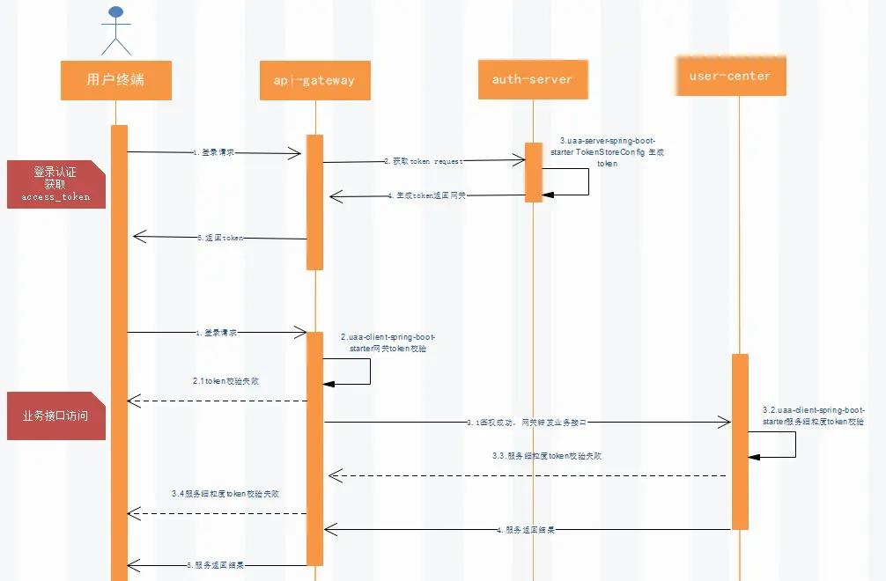
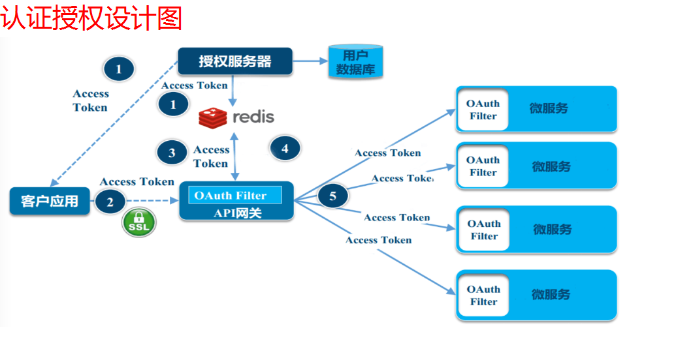
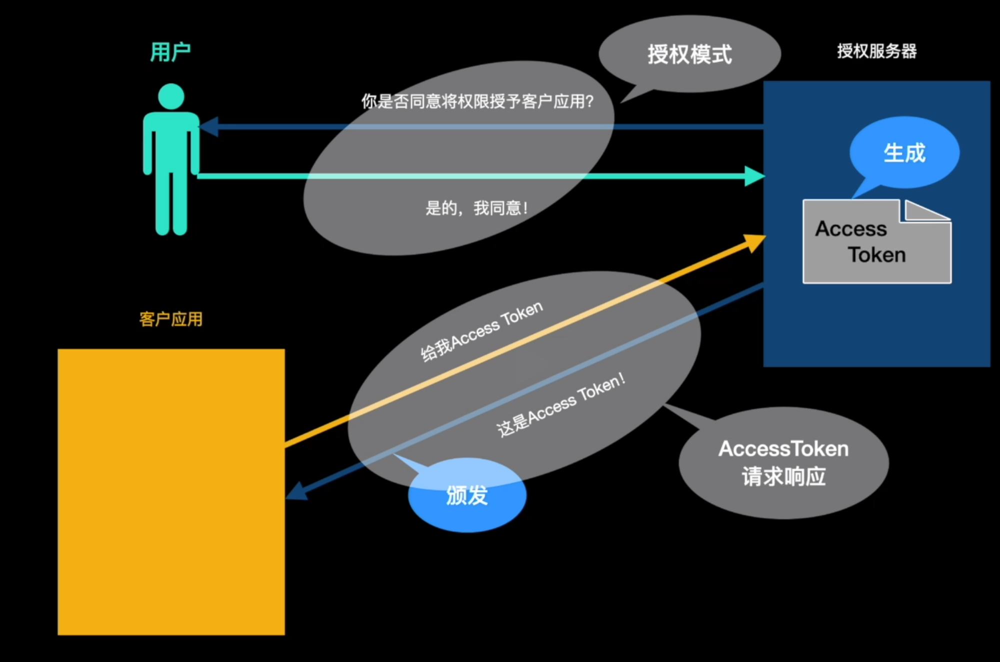
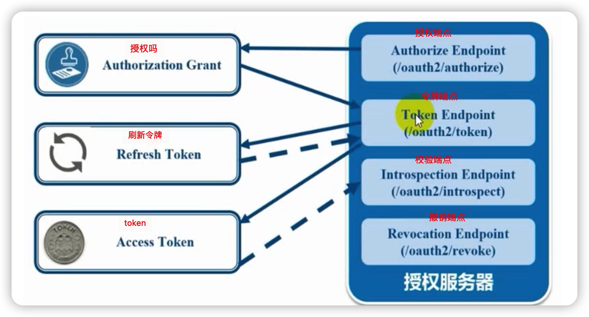
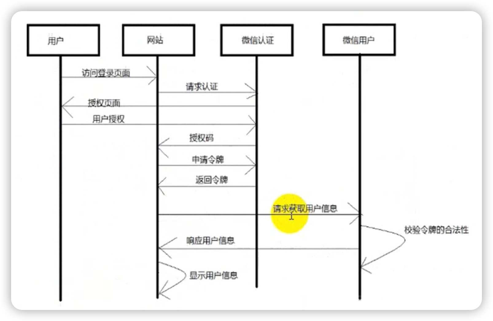
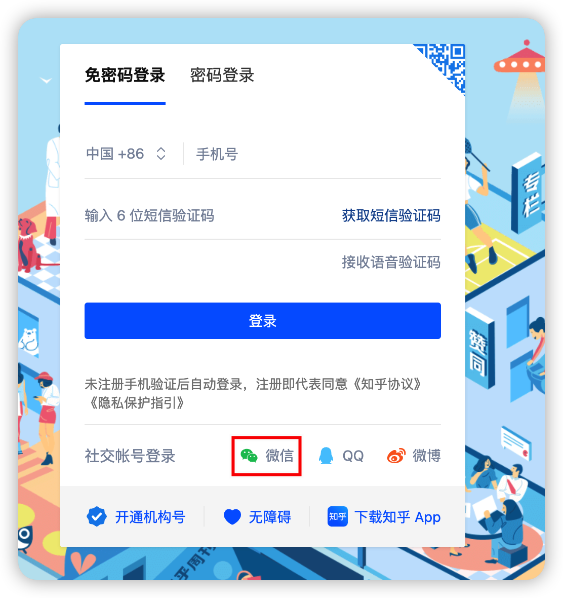
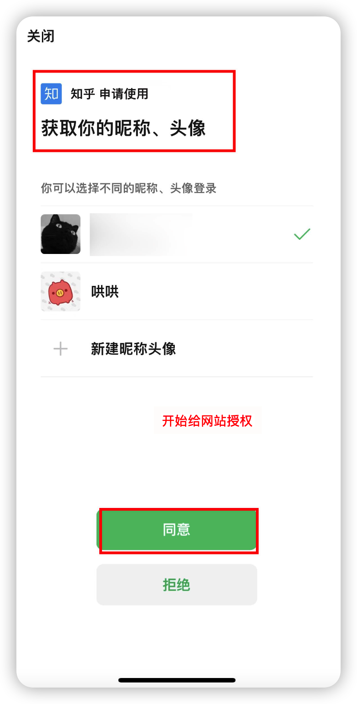
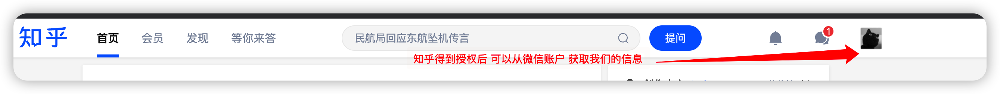
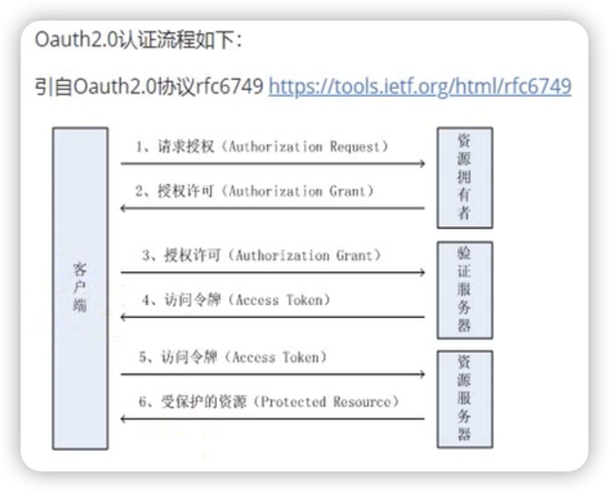
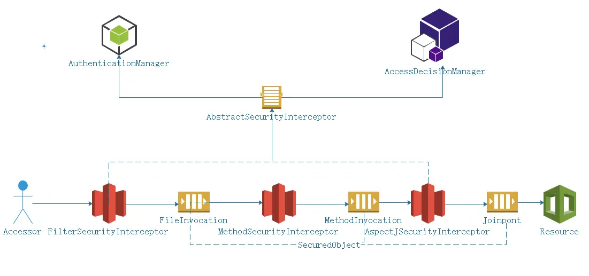

# 我们这个auth-service是授权服务器    

# 授权服务器   
看看auth-server所在的位置    
      

   

   

客户应用、授权服务、用户三者之间的交互流程如下：

1. 客户应用请求授权服务器获取Access Token
2. 授权服务器咨询用户意见
3. 用户同意授权
4. 授权服务器颁发Access Token 给 客户应用     

需要用户同意授权，授权服务器才发token_id给客户应用    

认证服务器颁发token核心流程
/oauth/token?grant_type=password #请求授权token
/oauth/token?grant_type=refresh_token #刷新token
/oauth/check_token #校验token
/oauth/authorize #授权码模式    

OAUTH核心处理调用关系       

   

* Authorize Endpoint ：授权端点，进行授权    
* Token Endpoint ：令牌端点，进过授权拿到对应的Token    
* Introspection Endpoint：校验端点，校验Token的合法性    
* Revocation Endpoint ：撤销端点，撒销授权     

完整流程介绍：   
（A）用户打开客户端以后，客户端要求用户给予授权。       
（B）用户同意给予客户端授权。

（C）客户端使用上一步获得的授权，向认证服务器申请令牌。

（D）认证服务器对客户端进行认证以后，确认无误，同意发放令牌。

（E）客户端使用令牌，向资源服务器申请获取资源。

（F）资源服务器确认令牌无误，同意向客户端开放资源。   

图解：   
       

完整流程用例介绍：   

1. 用户进入网站的登陆界面，点击微信图标以微信账号登陆，该系统，用户是自己在微信里信息的资源拥有者。    

    

点击微信弹出一个二维码，此时用户扫描二维码，开始给网站授权。   
    

2. 资源拥有者同意给客户端授权
资源拥有者扫描二维码表示资源拥有者同意给客户端授权，微信会对资源拥有者的身份进行验证，验证通过后，微信会询问用户是否给授权网站访问自己的微信数据，用户点击'确认登录"表示同意授权，微信认证服务器会颁发个授权码，并重定向会网站。

   

3. 客户端获取到授权码，请求认证服务器申请令牌    
此过程用户看不到，客户端应用程序请求认证服务器，请求携带授权码。     

4. 认证服务器向客户端响应令牌    
认证服务器验证了客户端请求的授权码，如果合法则给客户端颁发令牌，令牌是客户端访问资源的通行证。此交互过程用户看不到，当客户端拿到令牌后，用户在网站看到已经登录成功，    

    

5. 客户端请求资源服务器的资源
客户端携带令牌访问资源服务器的资源。网站携带令牌请求访问微信服务器获取用户的基本信息

6. 资源服务器返回受保护资源
资源服务器校验令牌的合法性，如果合法则向用户响应资源信息内容。

注意：资源服务器和认证服务器也可以是统一个服务器，也可以是分开的服务器。如果是分开的服务器通常要求认证服务器来校验令牌的合法性。

   

### 了解了基本知识后，我们来设计下Oauth   

# Spring Security Oauth基本设计    

    

