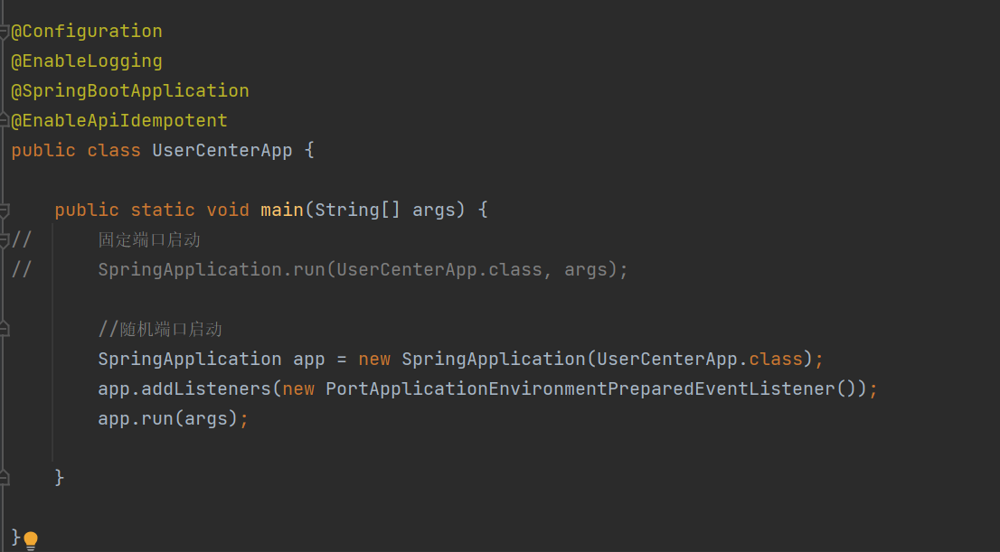
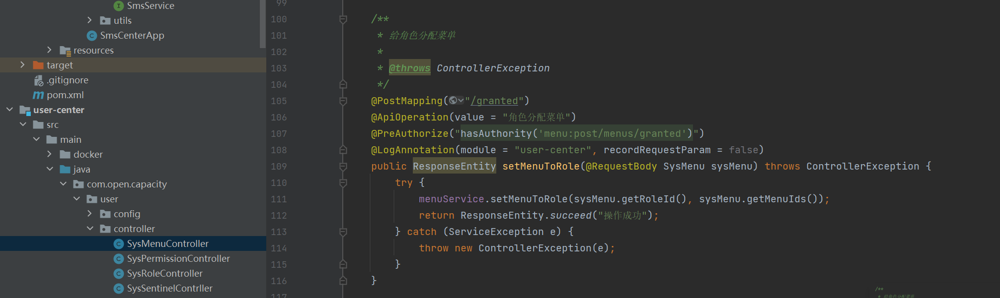
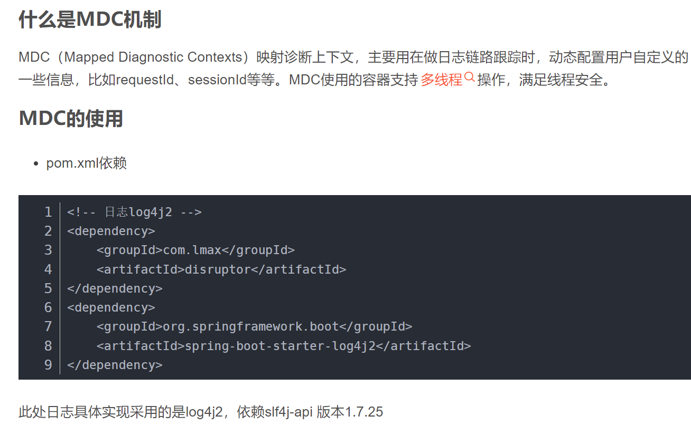

看文档     

在启动类上添加@EnableLogging开启日志后
    
在Controller层就能用日志了    
    

# sleuth   
<https://blog.csdn.net/u012256142/article/details/82835356>
<https://blog.csdn.net/weixin_48967543/article/details/117660411?utm_medium=distribute.pc_relevant.none-task-blog-2~default~baidujs_baidulandingword~default-4-117660411-blog-82835356.pc_relevant_multi_platform_whitelistv2&spm=1001.2101.3001.4242.3&utm_relevant_index=6>
<https://blog.csdn.net/gaoliang1719/article/details/120213357>

    

RestTemplate
<https://zhuanlan.zhihu.com/p/31681913>   

简历上写：  
用sleuth实现了日志模块的链路追踪     

