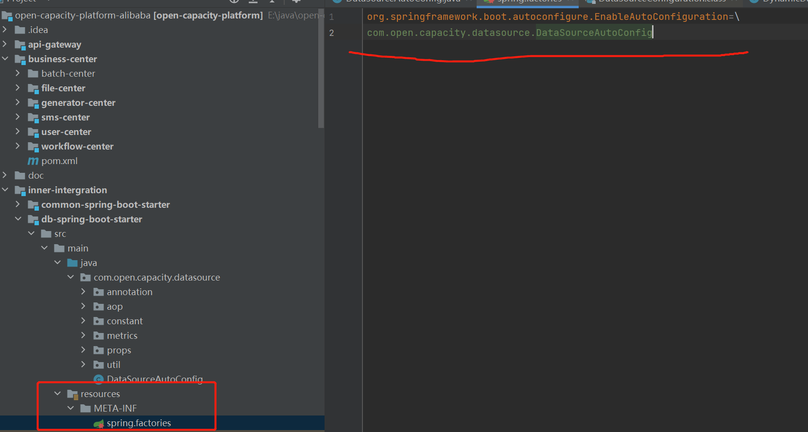

# 模仿springboot标准starter做法，实现项目通用的数据库处理，利用自动配置完成对象的基本装配   

----

##  集成druid数据源 
druid配置文件  
```
      initial-size: 1
      max-active: 20
      min-idle: 1
      # 配置获取连接等待超时的时间
      max-wait: 60000
      #打开PSCache，并且指定每个连接上PSCache的大小
      pool-prepared-statements: true
      max-pool-prepared-statement-per-connection-size: 20
      validation-query: SELECT 'x'
      test-on-borrow: false
      test-on-return: false 
      test-while-idle: true      
      #配置间隔多久才进行一次检测，检测需要关闭的空闲连接，单位是毫秒
      time-between-eviction-runs-millis: 60000
      #配置一个连接在池中最小生存的时间，单位是毫秒
      min-evictable-idle-time-millis: 300000
```
validation-query 校验查询连接  
test-while-idle 测试空闲的连接   

validationQuery和testWhileIdle这两个参数一起用,用来不间断检测是否有失效的链接,避免高并发的出现失效链接;

数据库连接池在初始化的时候会创建initialSize个连接，当有数据库操作时，会从池中取出一个连接。如果当前池中正在使用的连接数等于maxActive，则会等待一段时间，等待其他操作释放掉某一个连接，
如果这个等待时间超过了maxWait，则会报错；如果当前正在使用的连接数没有达到maxActive，则判断当前是否空闲连接，如果有则直接使用空闲连接，如果没有则新建立一个连接。在连接使用完毕后，不是将其物理连接关闭，而是将其放入池中等待其他操作复用。
同时连接池内部有机制判断，如果当前的总的连接数少于miniIdle，则会建立新的空闲连接，以保证连接数得到miniIdle。
如果当前连接池中某个连接在空闲了timeBetweenEvictionRunsMillis时间后仍然没有使用，则被物理性的关闭掉。有些数据库连接的时候有超时限制（mysql连接在8小时后断开），或者由于网络中断等原因，连接池的连接会出现失效的情况，这时候设置一个testWhileIdle参数为true，可以保证连接池内部定时检测连接的可用性，不可用的连接会被抛弃或者重建，最大情况的保证从连接池中得到的Connection对象是可用的。
当然，为了保证绝对的可用性，你也可以使用testOnBorrow为true（即在获取Connection对象时检测其可用性），不过这样会影响性能

这个druid的配置配置在nacos的各个核心模块的yaml文件中    
       

----

#  aop实现动态切换数据源

----

#####  切换数据源的用途就是，有些时候要在程序运行期间，添加新的数据库然后从新数据中读取数据,就是 core数据库配合log数据库使用   
不过这也是有缺点的，就是要在程序初始化的时候就要指定好运行期间要切换的所有数据源了，不能说在程序运行期间再添加新的数据源   
作者给我们提供了两种思路   
程序动态配置多数据源：

通过最上面我们对获取DynimaticDataSource对象的数据源连接的过程分析可知，
AbstractRoutingDataSource类是通过determineTargetDataSource()方法来获取数据源。在该方法里面，又使用了我们重写的抽象方法determineCurrentLookupKey()来判断使用哪一个数据源的key，通过这个key，
在数据源初始化后存放的集合resolvedDataSources中获取想要的数据源。     

因此，如果我们想要动态的添加数据源进去，有两种思路可以考虑，一是重写determineTargetDataSource()方法，并且我们自己配置一个数据源集合，通过该方法，
调用我们自己的数据源集合中对应的数据源。二是在resolvedDataSources属性中动态添加key-value进去，可以在determineTargetDataSource()方法中获取该数据源即可。    

----

##### 流程    
spring启动初始化DynimaticDataSource：

1、可以通过spring的自动注入，对AbstractRoutingDataSource类注入相应的属性，注入属性不是必须的，可以通过继承的子类重写这些方法来重新设置对这些属性的调用。

2、注入后spring会执行protected方法afterPropertiesSet()，该方法先判断属性targetDataSources不能为null，即必须初始化时注入至少一个数据源，否则抛出异常"Property 'targetDataSources' is required"。然后将该属性(类型为map)的值全部转换到属性resolvedDataSources(类型为map)中去。如果属性defaultTargetDataSource不为null，即已经设置默认数据源，将其转换为DataSource类型并赋值给属性defaultTargetDataSource。

经过以上处理后，属性resolvedDataSources中会被存放我们添加的数据源，该属性是一个map集合，key为Object类型，value为数据源。同时可能会有一个默认数据源(可以注入也可以不注入)。

使用DynimaticDataSource类获取连接：

1、调用该类的public方法getConnection()来获取连接,这个方法是AbstractRoutingDataSource里面有的方法   

2、getConnection在抽象类中被重写，会先调用protected方法determineTargetDataSource()。该方法先判断属性resolvedDataSources不为null，即初始化时候注入了至少一个数据源，否则抛出异常"DataSource router not initialized"。然后调用由子类重写的抽象方法determineCurrentLookupKey()获取dataSource在resolvedDataSources中对应的key，判断使用哪个数据源。

3、根据key从resolvedDataSources中获取数据源，如果resolvedDataSources中不存在，再判断lenientFallback为true(默认为true，可以设置)或key为null，返回默认数据源resolvedDefaultDataSource。否则抛出异常"Cannot determine target DataSource for lookup key [" + key+ "]"。

4、调用获取数据源的getConnection()方法获取连接。


----

####  AbstractRoutingDataSource源码  
```java
public abstract class AbstractRoutingDataSource extends AbstractDataSource implements InitializingBean {
    @Nullable
    private Map<Object, Object> targetDataSources;
    @Nullable
    private Object defaultTargetDataSource;
    private boolean lenientFallback = true;
    private DataSourceLookup dataSourceLookup = new JndiDataSourceLookup();
    @Nullable
    private Map<Object, DataSource> resolvedDataSources;
    @Nullable
    private DataSource resolvedDefaultDataSource;

    public AbstractRoutingDataSource() {
    }

    public void setTargetDataSources(Map<Object, Object> targetDataSources) {
        this.targetDataSources = targetDataSources;
    }

    public void setDefaultTargetDataSource(Object defaultTargetDataSource) {
        this.defaultTargetDataSource = defaultTargetDataSource;
    }

    public void setLenientFallback(boolean lenientFallback) {
        this.lenientFallback = lenientFallback;
    }

    public void setDataSourceLookup(@Nullable DataSourceLookup dataSourceLookup) {
        this.dataSourceLookup = (DataSourceLookup)(dataSourceLookup != null ? dataSourceLookup : new JndiDataSourceLookup());
    }

    public void afterPropertiesSet() {
        if (this.targetDataSources == null) {
            throw new IllegalArgumentException("Property 'targetDataSources' is required");
        } else {
            this.resolvedDataSources = new HashMap(this.targetDataSources.size());
            this.targetDataSources.forEach((key, value) -> {
                Object lookupKey = this.resolveSpecifiedLookupKey(key);
                DataSource dataSource = this.resolveSpecifiedDataSource(value);
                this.resolvedDataSources.put(lookupKey, dataSource);
            });
            if (this.defaultTargetDataSource != null) {
                this.resolvedDefaultDataSource = this.resolveSpecifiedDataSource(this.defaultTargetDataSource);
            }

        }
    }

    protected Object resolveSpecifiedLookupKey(Object lookupKey) {
        return lookupKey;
    }

    protected DataSource resolveSpecifiedDataSource(Object dataSource) throws IllegalArgumentException {
        if (dataSource instanceof DataSource) {
            return (DataSource)dataSource;
        } else if (dataSource instanceof String) {
            return this.dataSourceLookup.getDataSource((String)dataSource);
        } else {
            throw new IllegalArgumentException("Illegal data source value - only [javax.sql.DataSource] and String supported: " + dataSource);
        }
    }

    public Connection getConnection() throws SQLException {
        return this.determineTargetDataSource().getConnection();
    }

    public Connection getConnection(String username, String password) throws SQLException {
        return this.determineTargetDataSource().getConnection(username, password);
    }

    public <T> T unwrap(Class<T> iface) throws SQLException {
        return iface.isInstance(this) ? this : this.determineTargetDataSource().unwrap(iface);
    }

    public boolean isWrapperFor(Class<?> iface) throws SQLException {
        return iface.isInstance(this) || this.determineTargetDataSource().isWrapperFor(iface);
    }

    protected DataSource determineTargetDataSource() {
        Assert.notNull(this.resolvedDataSources, "DataSource router not initialized");
        Object lookupKey = this.determineCurrentLookupKey();
        DataSource dataSource = (DataSource)this.resolvedDataSources.get(lookupKey);
        if (dataSource == null && (this.lenientFallback || lookupKey == null)) {
            dataSource = this.resolvedDefaultDataSource;
        }

        if (dataSource == null) {
            throw new IllegalStateException("Cannot determine target DataSource for lookup key [" + lookupKey + "]");
        } else {
            return dataSource;
        }
    }

    @Nullable
    protected abstract Object determineCurrentLookupKey();
}
```

----

##### 代码如下：   

1. 数据源定义
```java
public enum DataSourceKey {
    core,log   //一个是核心数据库，一个是日志数据库
}
```

----

2. 做一些工具类方便后续操作,跳过了spring容器，直接操作多数据源   
* 切换数据源的类  
```java
public class DataSourceHolder{
    //用了ThreadLocal存储数据源   
    public static final ThreadLocal<DataSourceKey>  dataSourceKey = new ThreadLocal<>();
    
    //获取数据连接
    public static DataSourceKey getDataSourceKey() {
        
    }
    //设置数据连接
    public static void setDataSourceKey(DataSourceKey type) {
        dataSourceKey.set(type);
    }
    //清楚数据连接  
    public static void clearDataSourceKey() {
        dataSourceKey.remove();
    }
}
```

* aop程序运行时切换数据源类，里面用的到上的DataSourceHolder   
弄个切面@Aspect,作为advice(aop的通知)   
```java
@Slf4j
@Aspect
@Order(-1) // 保证该AOP在@Transactional之前执行
public class DataSourceAOP {

    /**
     *         * @annotation(ds)：
     *
     *         *会拦截注解DataSource  ds 的方法，否则不拦截;
     */
    @Before("@annotation(ds)")
    public void changeDataSource(JoinPoint point, DataSource ds) throws Throwable {
        String dsId = ds.name();
        try {
            DataSourceKey dataSourceKey = DataSourceKey.valueOf(dsId);
            DataSourceHolder.setDataSourceKey(dataSourceKey);
        } catch (Exception e) {
            log.error("数据源[{}]不存在，使用默认数据源 > {}", ds.name(), point.getSignature());   //getSignature()可以获取切点的参数
        }
    }

    //结束之后就清楚掉数据连接
    @After("@annotation(ds)")
    public void restoreDataSource(JoinPoint point, DataSource ds) {
        log.debug("Revert DataSource : {transIdo} > {}", ds.name(), point.getSignature());
        DataSourceHolder.clearDataSourceKey();
    }

}
```

* 对于切面里面的切入点表达式我们可以用自定义注解代替，只要有注解的类，就能用到aop，相当于给切入点表达式解耦了，不用在切面里每次都要重复指定
```java
@Target({ElementType.METHOD,ElementType.TYPE})   //METHOD：方法上可以使用，TYPE：类和接口上或枚举
@Retention(RetentionPolicy.RUNTIME)    //存储于Class文件中，可在jvm中读入
@Documented
public @interface DataSource {
    //数据库名称
    String name();
}
```
简单来说就是要用到的方法你就加上@DataSource注解表明这个是要被拦截的方法   

----

3. 创建一个类DynamicDataSource，继承AbstractRoutingDataSource，并重写determineCurrentLookupKey()方法。该方法负责判断当前线程使用哪一种数据源。
这是最简单的一种实现方法，不重写任何非抽象方法，但必须在初始化时配置至少一个的数据源
```java
public class DynamicDataSource extends AbstractRoutingDataSource{
    private Map<Object,Object> datasources;

    //动态数据源初始化
    public DynamicDataSource(){
        this.datasources = new HashMap<>();
        super.setTargetDataSources(datasources);  //要放一个数据源，初始化，后面可以再set      
    }

    //添加数据源
    public <T extends DataSource> void addDataSource(DataSourceKey key,T data) {
        datasources.put(key,data);
    }

    //该方法负责判断当前线程使用哪一种数据源
    @Override
    protected Object determineCurrentLookupKey() {
        return DataSourceHolder.getDataSourceKey();
    }
}
```
----

4. springboot自动配置类，原理在我自己的八股文springboot篇里有<https://github.com/SYFCCH/stereotyped-writing>              
```java
/**
 * 配置类
 * 配置数据源和切换数据源
 */

@Import(DataSourceAOP.class)
@AutoConfigureBefore(value={DruidDataSourceAutoConfigure.class, MybatisPlusAutoConfiguration.class})
@Configuration
@ConditionalOnProperty(name = {"spring.datasource.dynamic.enable"},matchIfMissing =false,havingValue = "true")    //当指定的属性有指定的值时进行实例化
public class DataSourceAutoConfig {
    //	创建数据源
    //	所有引入db-core的模块都需要一个核心库，可以是user-center，也可以是oauth-center,file-center ,sms-center
    @Bean
    @ConfigurationProperties("spring.datasource.druid.core")
    public DataSource dataSourceCore() {
        return DruidDataSourceBuilder.create().build();
    }
    //	所有的核心库共享一个日志中心模块，该模块不采用mysql中的innodb引擎，采用归档引擎
    @Bean
    @ConfigurationProperties("spring.datasource.druid.log")
    public DataSource dataSourceLog(){
        return DruidDataSourceBuilder.create().build();
    }

    @Primary    //赋予bean更高的优先级
    @Bean // 只需要纳入动态数据源到spring容器
    public DataSource dataSource() {
        DynamicDataSource dataSource = new DynamicDataSource();
        DataSource coreDataSource = dataSourceCore();
        DataSource logDataSource  = dataSourceLog();
        dataSource.addDataSource(DataSourceKey.core,coreDataSource);  //map集合里面是，名字-数据
        dataSource.addDataSource(DataSourceKey.log,logDataSource);
        dataSource.setDefaultTargetDataSource(coreDataSource);  //这是父类的方法，注入默认的数据源
        return dataSource;
    }

    @Bean // 将数据源纳入spring事务管理
    public DataSourceTransactionManager transactionManager(@Qualifier("dataSource")  DataSource dataSource) {
        return new DataSourceTransactionManager(dataSource);
    }
    
}

```


该模块涉及的一些注解:   

@AutoConfigureBefore     当前配置类在指定配置类之前执行,很多误区，详情见原理篇，误区非常多       

    
这个就是为了让这个注解真正的生效    
原理见<https://blog.csdn.net/weixin_39980809/article/details/110527657?spm=1001.2101.3001.6661.1&utm_medium=distribute.pc_relevant_t0.none-task-blog-2%7Edefault%7ECTRLIST%7ERate-1-110527657-blog-124484359.pc_relevant_antiscanv2&depth_1-utm_source=distribute.pc_relevant_t0.none-task-blog-2%7Edefault%7ECTRLIST%7ERate-1-110527657-blog-124484359.pc_relevant_antiscanv2&utm_relevant_index=1>


了解下spring.factories的用途：
###### springFactories机制
SpringFactories是spring提供的SPI机制，它读取META-INF/spring.factories文件中配置的接口实现类名称，然后在程序中读取这些配置文件并实例化。
在日常工作中，我们可能需要实现一些SDK或者Spring Boot Starter给被人使用，这个使用我们就可以使用Factories机制。Factories机制可以让SDK或者Starter的使用只需要很少或者不需要进行配置，只需要在服务中引入我们的jar包

Spring Boot的自动配置均是通过spring.factories来指定的，它的优先顺序最低（执行时机是最晚的）；通过扫描进来的一般都是你自己自定义的配置类，所以优先顺序是最高的，肯定在自动配置之前载入   

原理：   
SpringFactoriesLoader载荷从和实例化给定类型的工厂“META-INF / spring.factories”文件，其可存在于在类路径多个JAR文件。 该spring.factories文件必须为Properties格式，其中的关键是接口或抽象类的完全合格的名称和值是一个逗号分隔的实现类名的列表。 例如：
example.MyService=example.MyServiceImpl1,example.MyServiceImpl2
其中example.MyService是接口的名称，和MyServiceImpl1和MyServiceImpl2两种实现   

spring.factories文件是通过Properties解析得到的

请尽量不要让自动配置类既被扫描到了，又放在spring.factories配置了，否则后者会覆盖前者，很容易造成莫名其妙的错误     


小总结，对于三大注解（@AutoConfigureBefore、@AutoConfigureAfter、@AutoConfigureOrder）的正确使用姿势是应该是：请使用在你的自动配置里（一般是你自定义starter时使用）    


Spring Boot的自动配置是通过@EnableAutoConfiguration注解驱动的   

@ConditionalOnProperty      
在spring boot中有时候需要控制配置类是否生效,可以使用@ConditionalOnProperty注解来控制@Configuration是否生效
@Import 导入类让包先一步扫描这个类     
@ConfigurationProperties
读取配置文件
原理见<https://github.com/SYFCCH/stereotyped-writing/blob/main/Spring%20Boot.md>   


所以说这个resources/META-INF下的spring.factories文件的作用可以读取DataSourceAutoConfig并实例化
```properties
org.springframework.boot.autoconfigure.EnableAutoConfiguration=\
com.open.capacity.datasource.DataSourceAutoConfig
```
左边是springboot自动配置接口，右边是实现类，如果还有别的实现类，可以加\,

并且也能使得@AutoConfigureBefo真正生效    

----

5. 要用到多数据源的话可以使用这个配置文件,然后要在yaml文件中设置spring.datasource.dynamic.enable = true    
```
spring:
  datasource:
    dynamic:
      enable: true
    druid: 
      # JDBC 配置(驱动类自动从url的mysql识别,数据源类型自动识别)
      core:
        url: jdbc:mysql://59.110.164.254:3306/user-center?useUnicode=true&characterEncoding=utf-8&allowMultiQueries=true&useSSL=false 
        username: root
        password: root
        driver-class-name:  com.mysql.jdbc.Driver
      log:
        url: jdbc:mysql://59.110.164.254:3306/log-center?useUnicode=true&characterEncoding=utf-8&allowMultiQueries=true&useSSL=false 
        username: root
        password: root
        driver-class-name:  com.mysql.jdbc.Driver  
      #连接池配置(通常来说，只需要修改initialSize、minIdle、maxActive
      initial-size: 1
      max-active: 20
      min-idle: 1
      # 配置获取连接等待超时的时间
      max-wait: 60000
      #打开PSCache，并且指定每个连接上PSCache的大小
      pool-prepared-statements: true
      max-pool-prepared-statement-per-connection-size: 20
      validation-query: SELECT 'x'
      test-on-borrow: false
      test-on-return: false 
      test-while-idle: true      
      #配置间隔多久才进行一次检测，检测需要关闭的空闲连接，单位是毫秒
      time-between-eviction-runs-millis: 60000
      #配置一个连接在池中最小生存的时间，单位是毫秒
      min-evictable-idle-time-millis: 300000
      filters: stat,wall
      # WebStatFilter配置，说明请参考Druid Wiki，配置_配置WebStatFilter
      #是否启用StatFilter默认值true
      web-stat-filter.enabled: true
      web-stat-filter.url-pattern:  /*
      web-stat-filter.exclusions: "*.js , *.gif ,*.jpg ,*.png ,*.css ,*.ico , /druid/*"
      web-stat-filter.session-stat-max-count: 1000
      web-stat-filter.profile-enable: true
      # StatViewServlet配置
      #展示Druid的统计信息,StatViewServlet的用途包括：1.提供监控信息展示的html页面2.提供监控信息的JSON API
      #是否启用StatViewServlet默认值true
      stat-view-servlet.enabled: true
      #根据配置中的url-pattern来访问内置监控页面，如果是上面的配置，内置监控页面的首页是/druid/index.html例如：
      #http://110.76.43.235:9000/druid/index.html
      #http://110.76.43.235:8080/mini-web/druid/index.html
      stat-view-servlet.url-pattern:  /druid/*
      #允许清空统计数据
      stat-view-servlet.reset-enable:  true
      stat-view-servlet.login-username: admin
      stat-view-servlet.login-password: admin
      #StatViewSerlvet展示出来的监控信息比较敏感，是系统运行的内部情况，如果你需要做访问控制，可以配置allow和deny这两个参数
      #deny优先于allow，如果在deny列表中，就算在allow列表中，也会被拒绝。如果allow没有配置或者为空，则允许所有访问
      #配置的格式
      #<IP>
      #或者<IP>/<SUB_NET_MASK_size>其中128.242.127.1/24
      #24表示，前面24位是子网掩码，比对的时候，前面24位相同就匹配,不支持IPV6。
      #stat-view-servlet.allow=
      #stat-view-servlet.deny=128.242.127.1/24,128.242.128.1
      # Spring监控配置，说明请参考Druid Github Wiki，配置_Druid和Spring关联监控配置
      #aop-patterns= # Spring监控AOP切入点，如x.y.z.service.*,配置多个英文逗号分隔
################### mysq end ##########################
```


----

## pagehelper分页处理     
导maven   
这个很简单的使用起来      
使用规范   
在集合查询前使用PageHelper.startPage(pageNum,pageSize),并且中间不能穿插执行其他SQL      


# 模块中的Spring事务操作   
    


# db-spring-boot-starter如何使用

比如在用户中心中，首先引入db-spring-boot-starter 的 pom依赖

在nacos的配置中心配置好数据源   


然后编写Dao类
    

######  mapper注解或者mapperScan注解
<https://www.jb51.net/article/224817.htm>

###### 返回自增ID的方法  @Insert加@Optional    
分表由于不能映射到对应的表名实体， 所以不得不弃之    
然而手动拼接sql  然后 用@Insert 注解，由于因为业务需要 ，需要用到当前的自增id ，然而默认情况 并不会返回自增的id

于是乎，只能手动查询一次，（冗余查询操作）

解决方案就是在@Insert注解加上@Optional(useGeneratedKeys = true, keyProperty = "id")

useGeneratedKeys 设置为true， 表示在执行添加记录之后可以获取到数据库自动生成的主键ID；

keyProperty 表示当前返回主键ID 的接收对象；

由此，这样就解决了插入成功之后，冗余的查询功能， 节省了些数据库资源     


